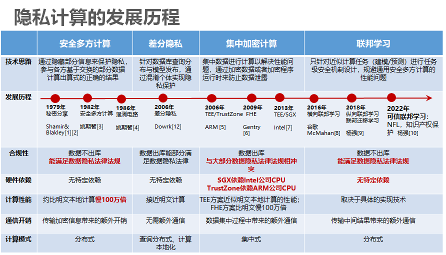
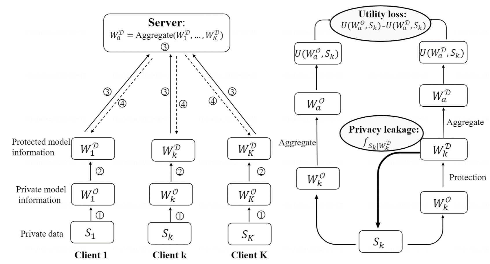

# 可信联邦学习最新论文：从信息论角度，提出隐私与模型性能的No-free lunch定理
科技的迅猛发展为我们的生活带来了极大的便利，随着人工智能和大数据与我们生活的深度契合，数据和模型与我们生活已经息息相关。我们知道未来的世界必将是一个充斥模型和数据的世界，而且一定是多方的模型、数据，合作和交易的一个世界。那么在保护数据安全的前提下进行联合建模是必然的需求，隐私计算也顺应这个需求蓬勃发展。

隐私计算目前大致经历了四个阶段。第一阶段多方安全计算：通过隐藏部分信息来保护隐私，参与各方基于交换的部分数据计算出算式的正确的结果。第二阶段差分隐私：针对数据库查询分布与模型发布，通过混淆个体实现隐私保护。第三阶段集中加密计算: 集中数据进行计算以解决性能问题，通过加密数据或者加密程序运行时来防止数据泄露。第四阶段（可信）联邦学习:针对近似计算任务（建模/预测）进行任务级安全机制设计，在保证安全性的前提下， 优化提升可信联邦学习的性能和效率。近两年，联邦学习被纳入Gartner技术成熟度曲线（全球科技新动向最具参考价值的报告之一），处于技术创新萌芽期的联邦学习正受到越来越多地关注，成为下一代隐私计算发展关键。

 

**首先，保证数据安全是所有隐私计算技术的根本目的**。随着隐私计算的商业化落地和大规模推广，来自极端情况下的恶意攻击，给各类隐私计算应用都带来了更大的安全性挑战：

安全性的挑战，主要来自多方数据合作过程中，对隐私安全不同的威胁模式，具体包括以下几种情况或者各种情况的叠加：

1. 外在攻击：可能来自窃听或者模型使用者对整体模型的攻击
2. 内在攻击：可能来自服务器端或联合模型训练参与者，发起的拜占庭攻击 Byzantine，女巫攻击 Sybil attacks等
3. 半诚实攻击：以获取其他用户隐私为目的的隐私攻击，但其攻击行为并不违反联邦学习算法规则，也不影响整体模型性能；
4. 恶意攻击：从攻击者自身利益出发，以改变整体模型性能为目的的攻击，其攻击行为可能违反联邦学习算法规则；
5. 训练阶段攻击：在训练阶段发起的攻击行为，具体又可分为半诚实攻击和恶意攻击。前者通过贝叶斯隐私攻击实施，后者包括对训练数据下毒，或在模型中加入暗门拜占庭攻击等；
6. 推理阶段攻击：在模型使用阶段发起的攻击行为， 其目的是为了盗取联邦学习模型、或者推断模型训练数据。

目前对于联邦学习的隐私攻击， 可以归纳为贝叶斯推断攻击（半诚实攻击者，根据观测到的公开信息，推断用户的私密数据），如果把联邦学习数据不动模型动的特点形象比喻为草场不动羊动的话，那么贝叶斯推断攻击可以形象比喻为攻击者通过观测羊的生长情况来反推出草生长的情况。现有的攻击方法根据泄露信息的不同有三种：根据更新的梯度攻击 ；根据模型输出进行攻击；暴力破解（密码学中观测到某些配对的明文和密文来攻击密钥）。

要求一项技术达到理论上的绝对安全，在各种极端特例情况下仍绝对安全，会导致算法设计和实现成本指数级上升。比如利用全同态加密来保护深度神经网络的所有参数，信息处理量和通讯传输量会很大，在实际应用中无法有效实现[18,19]。所以，半同态加密和各种提升通讯效率的改进方法被提出来，以保证学习效率达到实际要求[16]。这样对安全性和学习效率以及模型性能等因素综合考虑达成平衡的隐私计算解决方案，是业界普遍认可和广泛应用的[17]。

而从攻击者角度而言，它也要衡量攻击成本和获取数据的收益是否形成正比。而目前现有的攻击是需要有限成本的，认定攻击算法的时间复杂度为多项式时间，例如密码学中的暴力破解，对于指数级选择的密钥，时间复杂度就超过了多项式时间。

**针对不同安全威胁，联邦学习能够设计出不同的算法来应对。整体的思路是：增大攻击方的成本，使之大于收益**。合理的做法是基于现实需求情况下，去权衡隐私保护、模型性能、算法效率。联邦学习在保护数据安全方面的作用已经被大量验证且运用成熟，在现阶段，推广联邦学习技术面临的最大挑战之一就是在三者之间取得平衡: 即在安全可靠的前提下，最大化效率和有效性，并且可解释和可监管。基于此提出可信联邦学习（Trustworthy Federated Learning）：安全可证明，性能可使用，效率可控，决策可解释，模型可监管，普惠。

如上图所示，从安全的维度，可信联邦学习不仅仅要做到基于现实需求的最优平衡，我们要做到的是即使半诚实合作者乃至恶意攻击者参与到这个生态里面来，通过恶意的方式进行攻击，我们最后计算出来的模型不受其影响，能够抗干扰。最终实现基于数据安全的大前提，做到尽量的性能和算法最优。

另一个方面是可解释。我们不仅让这个模型变得有效率，还得决策可解释。比如在金融业务中申请贷款被拒绝了，用户为什么被拒绝？用户是想知道理由的，放款机构也是需要知道原因的。那么这个系统应该能自动的解释给用户和放款机构听。除此之外，对于监管人员来说，这个模型也是可以溯源、确权、可审计和可追责的。

那么要实现可信联邦学习，我们需要不断去迭代优化，和丰富理论基础。近期，针对如何理论分析并量化评估隐私安全，模型效用，及两者间的制约关系的问题，**可信联邦学习奠基性框架论文——《联邦学习中隐私与模型性能没有免费午餐定理》**，提出了**No-free lunch定理**：在降低隐私安全风险的前提下，模型效用的最大化存在一定上界；反之，盲目追求模型效用的最大化，会增大隐私安全风险的下界。

$$C_1 \leq \epsilon_p + C_2\epsilon_u$$

其中$C_1$和$C_2$为常数; $\epsilon_p$为贝叶斯隐私泄漏，它是攻击者观测暴露信息前后通过贝叶斯攻击对私密数据认知的差别; $\epsilon_u$为模型性能损失，它是采用隐私保护措施前后，模型性能的降低。
该论文从信息论的角度为隐私泄漏和效用损失的均衡评估提供了一个通用的框架。基于该框架， 本文给出了关于隐私与模型性能的 No-free lunch定理并应用到不同的隐私保护机制中， 包括随机方法[11]，使用稀疏性[14]以及同态加密[15]。结果表明，人们必须在一定程度上降低效用来更好地保护隐私，也即没有免费的午餐。该论文所阐述的定量分析可以为设计可信联邦学习算法提供有效的指导：
1. 通过理论分析计算, 确定最优算法设计，使其在满足隐私安全要求的前提下，最大化模型效用；
2. 将No-free lunch理论应用于不同保护机制（随机加噪声，使用稀疏性以及同态加密），指导设计不同保护方法的保护参数。

论文链接：[https://arxiv.org/abs/2203.05816](https://arxiv.org/abs/2203.05816)

#### 一、研究背景：联邦学习中隐私与效用不可兼得
在多方从各自的数据中共同学习模型联邦学习场景 中，**选择合适的算法时通常存在两个相互冲突的目标**。一方面，面对半诚实的合作伙伴，必须尽可能保证私人和敏感的训练数据的安全。另一方面，为了保证学习效用，必须在各方之间交换一定数量的信息[13]。

在现有的工作中，迫切需要为设计新的联邦学习算法奠定坚实的基础。特别是，最近的贝叶斯推理类型的威胁没有由现有的隐私定义明确建模，例如被认为是隐私黄金标准的差分隐私。这种严格公式的缺乏，使得从业者不清楚如何确定关于隐私效用权衡的算法设计的最佳选择。没有现有的框架可以同时考虑不同的保护机制，包括随机化和同态加密。

为了解决上述问题，该论文构建了一种新型贝叶斯隐私框架，该框架囊括了随机方法，使用稀疏性以及同态加密三种隐私保护机制，量化分析了隐私安全与模型效用两者之间的制约关系。
#### 二、新型的贝叶斯隐私泄露度量方法
该论文考虑了横向联邦学习场景，即多个（𝐾）参与者协作学习一个全局模型通过共享模型的信息而不暴露他们的私人训练数据。 为了对抗半诚实的攻击者可能通过模型的信息反推用户的私人数据, 用户参与联邦的过程中会给共享的模型信息加上保护机制。具体步骤如下：
1. 每位用户用自己的数据 $S_k$ 训练一个本地模型 $W_k^O$
2. 每位用户给本地的模型加上保护机制后 $W_k^D=M(W_k^O)$ 上传给服务器
3. 服务器聚合各方上传的保护后的模型 $W_a^D$ 并下发给用户
4. 用户根据下发的聚合后的模型再次训练，更新本地模型
5. 步骤1-4 循环进行直到模型性能不再提升

上图右侧中的隐私泄露和效用损失具体如下：

隐私泄露 $ϵ_p$:使用贝叶斯隐私泄露(BPL)度量方法，来量化在对公开信息应用了保护机制的情况下，半诚实攻击者仍然可能推断出的隐私数据的信息量。BPL度量方法能够评估一个联邦学习方案的安全性，并证明在BPL小于一个可接受的阈值的情况下，联邦学习所采用的保护机制在应对贝叶斯推理攻击时是安全的。

模型效用损失 $ϵ_u$:该保护机制将原始模型信息 $W_k^O$ 修改为被保护对象 $W_k^D$ ，导致局部模型的行为不准确。因此，聚合全局模型的精确度较低，产生的效用损失被定义为有保护和没有保护的效用之差。 

#### 三、隐私-效用权衡的一般框架
该论文首先将隐私-效用权衡定义为一个优化问题，使ε-贝叶斯隐私约束下的效用损失最小化。在隐私保护的机器学习场景中，客户的目标是保持最大可能的模型效用，而不披露超出可接受水平的私人信息。我们可以将这种权衡视为一个优化问题，其目标是在隐私保护约束下最小化效用损失。

$$\min_M \epsilon_u$$

$$s.t.  \epsilon_p \leq \epsilon$$

然后，该论文对贝叶斯隐私泄露与效用损失之间的权衡进行了严格的分析，并得出No free lunch theorem：

$$C_1 \leq \epsilon_p+C_2 \epsilon_u$$

其中, $C_1$ 是一个只与数据和攻击者的先验判断有关的常数。该不等式表明：
1. 不能同时达到贝叶斯隐私泄露和性能损失都为0的情况， 即没有免费的午餐；
2. 在降低隐私安全风险的前提下，模型效用的最大化存在一定上界；
3. 反之，盲目追求模型效用的最大化，会增大隐私安全风险的下界。

接下来，该论文还将贝叶斯隐私框架应用于三种隐私保护机制，分析了特定保护机制的参数对隐私泄露和效用损失的影响。

上文将贝叶斯推断攻击比喻为攻击者通过观测羊的生长情况来反推出草的信息，而保护机制则类似于给羊穿上防护服来干扰攻击者对羊的情况做出准确判断（如上图所示），但是另一方面穿上防护服会影响羊的生长速度（模型的效率）和走路速度（算法效率）等。No-free lunch理论表明，不能同时使羊长得好（吃草速度正常），又不会通过羊的生长情况泄露草的信息。

### 总结
隐私计算经过多年的发展，衍生出了不同的技术方向如安全多方计算（MPC）、同态加密（HE）、可信执行环境（TEE）、差分隐私（DP）等，联邦学习作为一种保护隐私的分布式机器学习范式，与这些技术并不是非此即彼的排斥关系。恰恰相反，联邦学习在综合评估各种技术优缺点的前提下，选择最适合的技术方案，以达成安全，性能与效率的最优均衡。 所以说，任何多方参与安全进行人工智能建模的过程，都是绕不开联邦学习的，联邦学习是隐私计算的“一站式”综合工具箱。

我们认为没有绝对安全无任何风险的技术，只有不断应对新的挑战迭代优化的技术。我们认为对任何一项技术方法本身，不能主观评价它好不好，而是要在实践应用中，去实地考察它是否实用，是否满足安全，性能和效率的要求，并根据现实条件约束和不同需求，权衡选择最优方案。No-free lunch理论，在可信联邦学习方向踏出了坚实的一步，相信在这个正确的方向上，会有越来越多的理论涌现，不断解决新的挑战。也期待大家一起共建~

### 参考文献：
* [1] Shamir, Adi  "How to share a secret,"Communications of the ACM*. **22** (11): 612–613, November 1979.
* [2] Blakley, G.R. "Safeguarding Cryptographic Keys," Managing Requirements Knowledge, International Workshop on (AFIPS), 48: 313–317, 1979
* [3] A. C. Yao, "Protocols for secure computations," 23rd Annual Symposium on Foundations of Computer Science (sfcs 1982), Chicago, IL, USA, 1982, pp. 160-164, doi: 10.1109/SFCS.1982.38.
* [4] A. C. Yao, "How to generate and exchange secrets," 27th Annual Symposium on Foundations of Computer Science (sfcs 1986), Toronto, ON, Canada, 1986, pp. 162-167, doi: 10.1109/SFCS.1986.25.
* [5] ARM. ARM Security Technology – Building a Secure System using TrustZone Technology. ARM Technical White Paper, 2009. http://infocenter.arm.com/help/topic/com. arm.doc.prd29-genc-009492c/PRD29-GENC-009492C_ trustzone_security_whitepaper.pdf.
* [6] Craig Gentry.  "Fully homomorphic encryption using ideal lattices," In Proceedings of the forty-first annual ACM symposium on Theory of computing (STOC '09). Association for Computing Machinery, New York, NY, 2009
* [7] Ittai Anati, Shay Gueron, Simon P Johnson, and Vincent R Scarlata. "Innovative technology for cpu based attestation and sealing," In Proceedings of the 2nd International Workshop on Hardware and Architectural Support for Security and Privacy, HASP, volume 13, 2013.
* [8] Brendan McMahan, Eider Moore Daniel Ramage, Blaise Agüera y Arcas. "Communication-Efficient Learning of Deep Networks from Decentralized Data," AISTATS 2017, 1273-1282
* [9] Qiang Yang, Yang Liu, Tianjian Chen, and Yongxin Tong. "Federated Machine Learning: Concept and Applications,"" ACM Trans. Intell. Syst. Technol. 10, 2, Article 12 (February 2019), 19 pages.
* [10] Qiang Yang Anbu Huang Lixin Fan Chee Seng Chan Jian Han Lim Kam Woh Ng  Ding Sheng Onge Bowen Li Secure Federated Learning: Towards Privacy-preserving and IP-right-preserving Artificial Intelligence
* [11] Abadi M, Chu A, Goodfellow I, et al. Deep learning with differential privacy[C]//Proceedings of the 2016 ACM SIGSAC conference on computer and communications security. 2016: 308-318.
* [12] Gentry C. A fully homomorphic encryption scheme[M]. Stanford university, 2009.
* [13] Qiang Yang, Yang Liu, Tianjian Chen, and Yongxin Tong. Federated machine learning: Concept and applications. ACM Transactions on Intelligent Systems and Technology (TIST), 10(2):1–19, 2019. 
* [14] Reza Shokri and Vitaly Shmatikov. Privacy-preserving deep learning. In Proceedings of the 22nd ACM SIGSAC conference on computer and communications security, pages 1310–1321, 2015.
* [15] Gentry C. A fully homomorphic encryption scheme[M]. Stanford university, 2009.
* [16] Zhang C, Li S, Xia J, et al. {BatchCrypt}: Efficient Homomorphic Encryption for {Cross-Silo} Federated Learning[C]//2020 USENIX Annual Technical Conference (USENIX ATC 20). 2020: 493-506.
* [17] Li T, Sahu A K, Talwalkar A, et al. Federated learning: Challenges, methods, and future directions[J]. IEEE Signal Processing Magazine, 2020, 37(3): 50-60.
* [18] Gilad-Bachrach R, Dowlin N, Laine K, et al. Cryptonets: Applying neural networks to encrypted data with high throughput and accuracy[C]//International conference on machine learning. PMLR, 2016: 201-210.
* [19] Aono Y, Hayashi T, Wang L, et al. Privacy-preserving deep learning via additively homomorphic encryption[J]. IEEE Transactions on Information Forensics and Security, 2017, 13(5): 1333-1345.

